# Dependency Inversion Principle - Part 2: Dependency Injection in C#

*Manual dependency injection, poor man's IoC, .NET DI, multiple implementations, and factories*

---

## Where Part 1 Left Off

In Part 1, we saw the main idea behind the **Dependency Inversion Principle**.

Before DIP:

> OrderService directly depends on SmtpEmailSender.

```text
OrderService -> SmtpEmailSender
```

After DIP:

> OrderService depends on IEmailSender, and SmtpEmailSender implements IEmailSender.

```text
OrderService -> IEmailSender <- SmtpEmailSender
```

That design is better because the high-level business code depends on an abstraction.

Here is the dependency direction before and after.

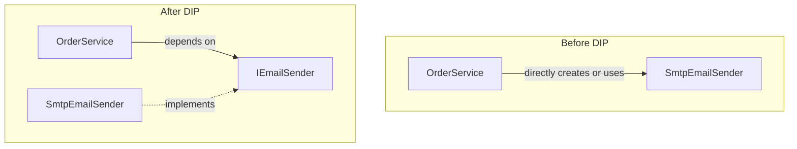

Before DIP:

> The high-level business class points to the low-level technical detail.

After DIP:

> Both the high-level class and the low-level class point toward the abstraction.

That is the inversion.

The business code no longer points directly at the technical detail.

This raises a practical question:

> If `OrderService` depends on `IEmailSender`, who creates the real `SmtpEmailSender` object?

That is where **dependency injection** comes in.

---

## Dependency Injection in Simple English

Dependency injection means:

> A class receives the objects it needs from the outside.

The class does not create those objects itself.

Without dependency injection:

> `OrderService` creates its own concrete dependency.

```csharp
public sealed class OrderService
{
    private readonly IEmailSender _emailSender = new SmtpEmailSender();
}
```

With dependency injection:

> `OrderService` receives the dependency through its constructor.

```csharp
public sealed class OrderService
{
    private readonly IEmailSender _emailSender;

    public OrderService(IEmailSender emailSender)
    {
        _emailSender = emailSender;
    }
}
```

The important change is small but powerful.

`OrderService` no longer decides which email sender to create.

It only declares what it needs.

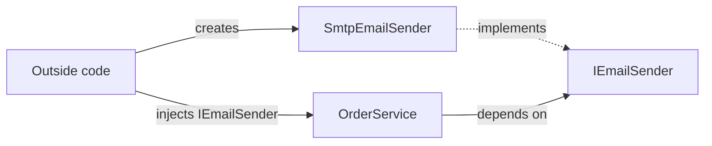

---

## Manual Dependency Injection

Let us start without any framework.

No ASP.NET Core.  
No `Microsoft.Extensions.DependencyInjection`.  
Just plain C#.

First, define the abstraction.

```csharp
public interface IEmailSender
{
    void Send(string to, string subject, string body);
}
```

Then create one concrete implementation.

```csharp
public sealed class SmtpEmailSender : IEmailSender
{
    public void Send(string to, string subject, string body)
    {
        Console.WriteLine($"SMTP email sent to {to}");
    }
}
```

Now create the high-level service.

```csharp
public sealed class OrderService
{
    private readonly IEmailSender _emailSender;

    public OrderService(IEmailSender emailSender)
    {
        _emailSender = emailSender;
    }

    public void ConfirmOrder(int orderId, string customerEmail)
    {
        Console.WriteLine($"Order {orderId} confirmed.");

        _emailSender.Send(
            customerEmail,
            "Order confirmed",
            $"Your order {orderId} is confirmed.");
    }
}
```

Now wire the objects manually.

```csharp
IEmailSender emailSender = new SmtpEmailSender();
var orderService = new OrderService(emailSender);

orderService.ConfirmOrder(42, "customer@example.com");
```

That is dependency injection.

There is no container here.

We created the dependency manually and passed it into the constructor.

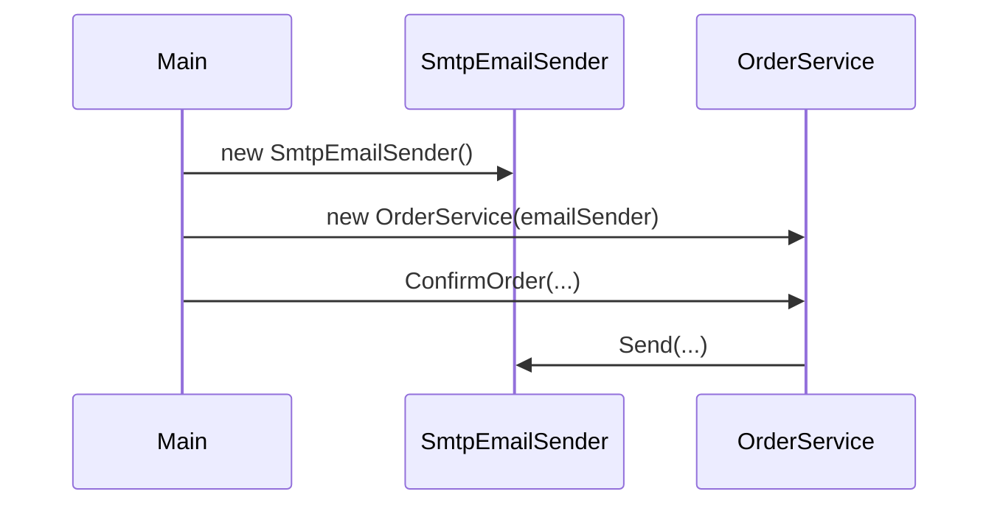

---

## What Changed?

The `new` keyword did not disappear.

It simply moved.

Before dependency injection:

> `OrderService` creates `SmtpEmailSender`.

```text
OrderService creates SmtpEmailSender
```

After dependency injection:

> `Main` creates `SmtpEmailSender` and gives it to `OrderService`.

```text
Main creates SmtpEmailSender and gives it to OrderService
```

This matters because `OrderService` is no longer responsible for object creation.

It is responsible only for order behavior.

---

## Manual Injection With Multiple Dependencies

Real classes often need more than one dependency.

```csharp
public interface IOrderRepository
{
    void Save(int orderId);
}

public sealed class SqlOrderRepository : IOrderRepository
{
    public void Save(int orderId)
    {
        Console.WriteLine($"Order {orderId} saved to SQL.");
    }
}
```

Now `OrderService` needs both dependencies.

```csharp
public sealed class OrderService
{
    private readonly IOrderRepository _orderRepository;
    private readonly IEmailSender _emailSender;

    public OrderService(
        IOrderRepository orderRepository,
        IEmailSender emailSender)
    {
        _orderRepository = orderRepository;
        _emailSender = emailSender;
    }

    public void ConfirmOrder(int orderId, string customerEmail)
    {
        _orderRepository.Save(orderId);

        _emailSender.Send(
            customerEmail,
            "Order confirmed",
            $"Your order {orderId} is confirmed.");
    }
}
```

Manual wiring becomes:

> Create the dependencies first, then pass them into `OrderService`.

```csharp
IOrderRepository orderRepository = new SqlOrderRepository();
IEmailSender emailSender = new SmtpEmailSender();

var orderService = new OrderService(orderRepository, emailSender);

orderService.ConfirmOrder(42, "customer@example.com");
```

This is still clear.

But as an application grows, the manual wiring code becomes repetitive.

---

## Poor Man's IoC

IoC means **Inversion of Control**.

In simple English:

> Instead of a class controlling how its dependencies are created, something outside the class controls creation.

A very small manual container is sometimes called **poor man's IoC**.

It is not a production-ready container.

It is useful because it shows the idea clearly.

```csharp
public sealed class SimpleContainer
{
    private readonly Dictionary<Type, Func<object>> _registrations = new();

    public SimpleContainer()
    {
        Register<IEmailSender>(() => new SmtpEmailSender());
        Register<IOrderRepository>(() => new SqlOrderRepository());
        Register<OrderService>(() =>
            new OrderService(
                Resolve<IOrderRepository>(),
                Resolve<IEmailSender>()));
    }

    public void Register<TService>(Func<object> factory)
    {
        _registrations[typeof(TService)] = factory;
    }

    public TService Resolve<TService>()
    {
        if (!_registrations.TryGetValue(typeof(TService), out var factory))
        {
            throw new InvalidOperationException(
                $"No registration found for {typeof(TService).Name}.");
        }

        return (TService)factory();
    }
}
```

Now `Main` becomes very small.

```csharp
var container = new SimpleContainer();

var orderService = container.Resolve<OrderService>();

orderService.ConfirmOrder(42, "customer@example.com");
```

This is a good first step because `Main` does not need to know how to build the whole object graph.

The container owns the registration and creation rules.

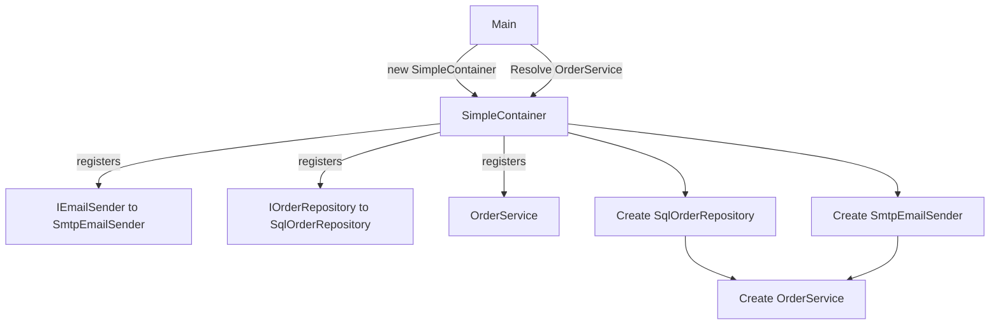

---

## What Poor Man's IoC Teaches Us

This simple container shows three important ideas.

**Central registration**

Object creation rules are written in one place.

**Resolution**

Application code asks for `OrderService`, and the container builds what is needed.

**Inversion of control**

`OrderService` no longer controls dependency creation.

The container controls it.

But this simple container has many limitations.

It does not properly support several production features:

- lifetimes
- scoped services
- automatic constructor selection
- disposal
- validation
- multiple registrations
- open generics

That is why real applications usually use a real DI container.

---

## Now Enter .NET Dependency Injection

ASP.NET Core includes a built-in DI container.

It is provided by `Microsoft.Extensions.DependencyInjection`.

With it, we can write registration code like this:

> Map abstractions to concrete implementations at startup.

```csharp
var builder = WebApplication.CreateBuilder(args);

builder.Services.AddScoped<IEmailSender, SmtpEmailSender>();
builder.Services.AddScoped<IOrderRepository, SqlOrderRepository>();
builder.Services.AddScoped<OrderService>();

var app = builder.Build();
```

Now ASP.NET Core knows how to create `OrderService`.

When `OrderService` asks for `IEmailSender`, the container provides `SmtpEmailSender`.

When it asks for `IOrderRepository`, the container provides `SqlOrderRepository`.

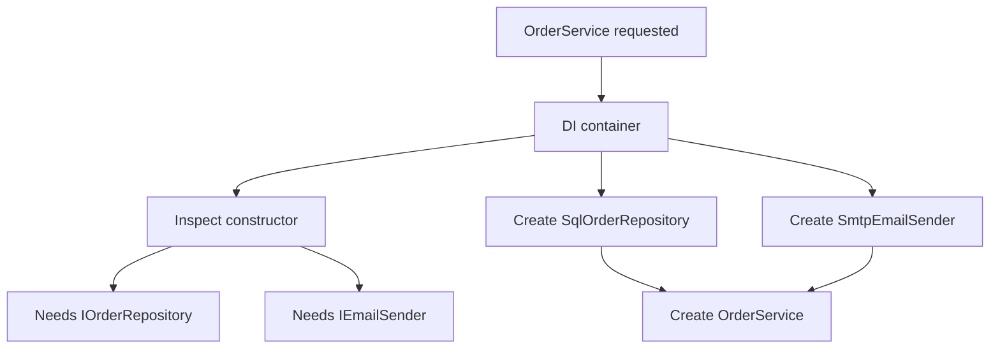

---

## The `new` Keyword Still Happens

DI does not mean objects are created without constructors.

Objects still get created.

Somewhere under the hood, the container still does the equivalent of this:

> Construct concrete objects and pass them into constructors.

```csharp
var orderRepository = new SqlOrderRepository();
var emailSender = new SmtpEmailSender();
var orderService = new OrderService(orderRepository, emailSender);
```

The difference is that your business class does not do this work.

The container does it based on the registrations.

So when people say "avoid `new`", the practical meaning is:

> Avoid creating concrete dependencies inside high-level business classes.

It does not mean `new` is evil.

It means object creation should happen at the boundary of the application or inside the container.

---

## Useful Features of .NET DI

.NET DI gives us several useful features.

**Central registration**

All mappings can be registered at startup.

```csharp
builder.Services.AddScoped<IEmailSender, SmtpEmailSender>();
builder.Services.AddScoped<IOrderRepository, SqlOrderRepository>();
builder.Services.AddScoped<OrderService>();
```

**Automatic resolution**

If `OrderService` has constructor parameters, the container tries to resolve them automatically.

```csharp
public OrderService(
    IOrderRepository orderRepository,
    IEmailSender emailSender)
{
    _orderRepository = orderRepository;
    _emailSender = emailSender;
}
```

**Lifetime management**

The container controls how long objects live.

```csharp
builder.Services.AddTransient<IEmailSender, SmtpEmailSender>();
builder.Services.AddScoped<IOrderRepository, SqlOrderRepository>();
builder.Services.AddSingleton<SystemClock>();
```

The common lifetimes are:

- `Transient`: a new instance is created each time it is requested
- `Scoped`: one instance is created per scope, such as one web request
- `Singleton`: one instance is created for the whole application

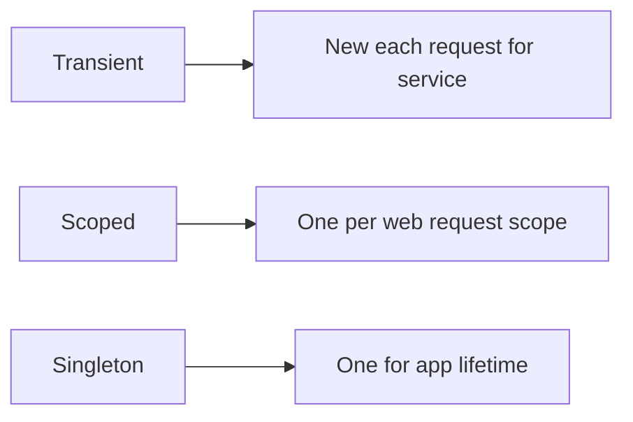

---

## What If One Abstraction Has Two Implementations?

Now imagine we have two email senders.

```csharp
public sealed class SmtpEmailSender : IEmailSender
{
    public void Send(string to, string subject, string body)
    {
        Console.WriteLine($"SMTP email sent to {to}");
    }
}

public sealed class SendGridEmailSender : IEmailSender
{
    public void Send(string to, string subject, string body)
    {
        Console.WriteLine($"SendGrid email sent to {to}");
    }
}
```

What happens if both are registered?

```csharp
builder.Services.AddScoped<IEmailSender, SmtpEmailSender>();
builder.Services.AddScoped<IEmailSender, SendGridEmailSender>();
```

If a class asks for one `IEmailSender`, the default .NET container uses the last registration.

That is important to know, but it is not the model we want when multiple implementations are intentional.

```csharp
public OrderService(IEmailSender emailSender)
{
    _emailSender = emailSender;
}
```

In this case, `SendGridEmailSender` is used because it was registered last.

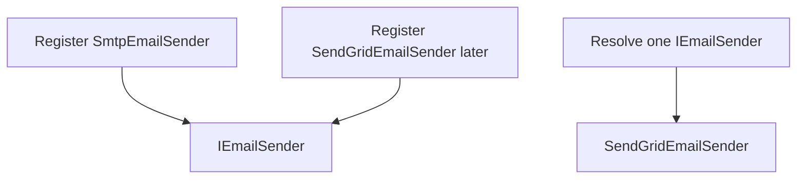

If multiple implementations should all be available, ask for `IEnumerable<IEmailSender>` instead. The container then provides all registered implementations in order.

```csharp
public sealed class NotificationPreviewService
{
    private readonly IEnumerable<IEmailSender> _emailSenders;

    public NotificationPreviewService(IEnumerable<IEmailSender> emailSenders)
    {
        _emailSenders = emailSenders;
    }
}
```

Then both `SmtpEmailSender` and `SendGridEmailSender` are available.

---

## How Should We Use Multiple Implementations?

When multiple implementations exist, assume they are intentional. That means we usually do not want to hide them behind one active implementation. Instead, we make all implementations available and then decide how they should be used.

There are two common cases.

**Use all implementations**

This is useful when a service intentionally coordinates every implementation.

```csharp
public sealed class EmailAuditService
{
    private readonly IEnumerable<IEmailSender> _emailSenders;

    public EmailAuditService(IEnumerable<IEmailSender> emailSenders)
    {
        _emailSenders = emailSenders;
    }

    public void SendAuditEmail(string message)
    {
        foreach (var emailSender in _emailSenders)
        {
            emailSender.Send("admin@example.com", "Audit", message);
        }
    }
}
```

Here, both `SmtpEmailSender` and `SendGridEmailSender` are meant to be used. The service receives all registered implementations through `IEnumerable<IEmailSender>`.

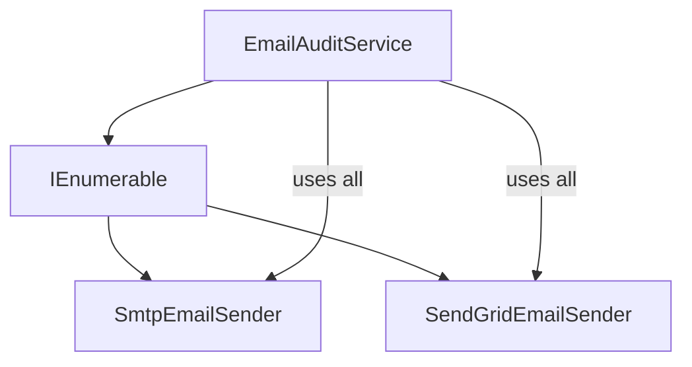

**Use a factory**

This is useful when all implementations are available, but only one should be used for a specific runtime case.

```csharp
public sealed class EmailSenderFactory
{
    private readonly IEnumerable<IEmailSender> _emailSenders;

    public EmailSenderFactory(IEnumerable<IEmailSender> emailSenders)
    {
        _emailSenders = emailSenders;
    }
}
```

Runtime data means information known only while the application is running, such as:

- customer type
- tenant
- country
- feature flag
- payment method
- notification channel

If the rule is:

> Use SendGrid for customers and SMTP for internal admin emails.

then the factory can choose the correct implementation for that specific case while still receiving all implementations from DI.

---

## Advanced Topic: DI and the Factory Pattern

Dependency injection and the Factory Pattern solve related but different problems. DI provides the dependencies that are known at startup. A factory chooses between available dependencies when the decision depends on runtime data.

**DI answers this question**

How do I provide a class with the dependencies it needs?

**Factory Pattern answers this question**

How do I create or choose an object when the choice depends on runtime information?

So the practical rule is:

> DI handles fixed startup dependencies, and factories handle runtime variation.

```text
Use DI when your dependencies are fixed at startup.
Use a Factory when your dependencies vary at runtime.
```

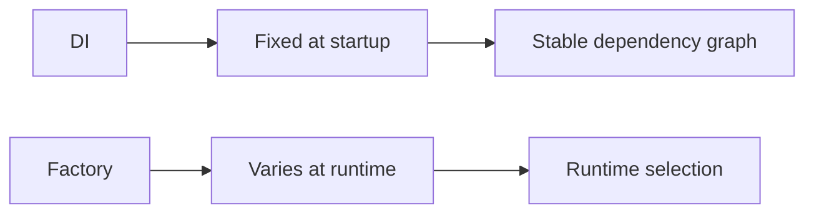

---

## Advanced Example: Factory With DI

Let us model a notification system. Some orders should send email. Some orders should send SMS. The choice depends on the customer's preference at runtime.

```csharp
public enum NotificationChannel
{
    Email,
    Sms
}
```

Create one abstraction.

```csharp
public interface INotificationSender
{
    NotificationChannel Channel { get; }

    void Send(string destination, string message);
}
```

Create two implementations.

```csharp
public sealed class EmailNotificationSender : INotificationSender
{
    public NotificationChannel Channel => NotificationChannel.Email;

    public void Send(string destination, string message)
    {
        Console.WriteLine($"Email sent to {destination}: {message}");
    }
}

public sealed class SmsNotificationSender : INotificationSender
{
    public NotificationChannel Channel => NotificationChannel.Sms;

    public void Send(string destination, string message)
    {
        Console.WriteLine($"SMS sent to {destination}: {message}");
    }
}
```

Now create a factory.

```csharp
public interface INotificationSenderFactory
{
    INotificationSender Create(NotificationChannel channel);
}
```

The factory receives all senders from DI.

```csharp
public sealed class NotificationSenderFactory : INotificationSenderFactory
{
    private readonly IEnumerable<INotificationSender> _senders;

    public NotificationSenderFactory(IEnumerable<INotificationSender> senders)
    {
        _senders = senders;
    }

    public INotificationSender Create(NotificationChannel channel)
    {
        var sender = _senders.FirstOrDefault(sender => sender.Channel == channel);

        if (sender is null)
        {
            throw new InvalidOperationException(
                $"No notification sender registered for {channel}.");
        }

        return sender;
    }
}
```

Register everything in DI.

```csharp
builder.Services.AddScoped<INotificationSender, EmailNotificationSender>();
builder.Services.AddScoped<INotificationSender, SmsNotificationSender>();
builder.Services.AddScoped<INotificationSenderFactory, NotificationSenderFactory>();
builder.Services.AddScoped<OrderNotificationService>();
```

Use the factory from the high-level service.

```csharp
public sealed class OrderNotificationService
{
    private readonly INotificationSenderFactory _notificationSenderFactory;

    public OrderNotificationService(
        INotificationSenderFactory notificationSenderFactory)
    {
        _notificationSenderFactory = notificationSenderFactory;
    }

    public void NotifyCustomer(
        NotificationChannel channel,
        string destination,
        string message)
    {
        var sender = _notificationSenderFactory.Create(channel);

        sender.Send(destination, message);
    }
}
```

The flow is:

> The service asks the factory for the sender that matches the runtime channel.

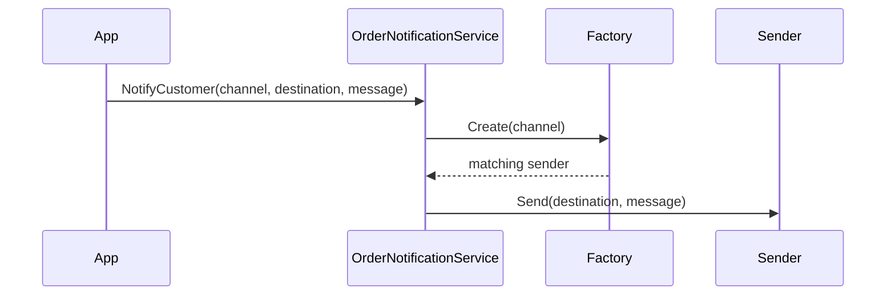

---

## Advanced Relationship: DI and Factory Pattern

DI and Factory Pattern work well together. DI creates the stable object graph. The factory handles runtime choices inside that graph.

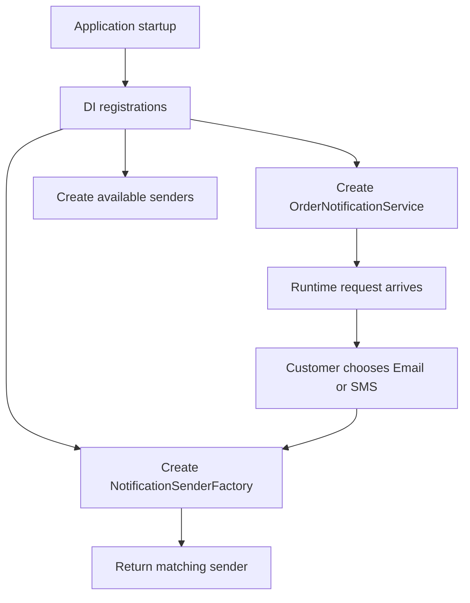

In this design:

> DI builds the stable parts, and the factory chooses the runtime-specific part.

- DI gives `OrderNotificationService` the factory
- DI gives the factory all available senders
- the factory chooses the right sender at runtime
- the service stays focused on the business workflow

---

## A Common Mistake

A common mistake is to inject the service provider everywhere and resolve dependencies manually.

```csharp
public sealed class OrderNotificationService
{
    private readonly IServiceProvider _serviceProvider;

    public OrderNotificationService(IServiceProvider serviceProvider)
    {
        _serviceProvider = serviceProvider;
    }

    public void NotifyCustomer(NotificationChannel channel, string destination)
    {
        var sender = _serviceProvider.GetRequiredService<INotificationSender>();

        sender.Send(destination, "Your order is confirmed.");
    }
}
```

This often hides dependencies.

`OrderNotificationService` looks like it only needs `IServiceProvider`, but it actually needs notification senders.

Prefer a specific factory instead.

```csharp
public sealed class OrderNotificationService
{
    private readonly INotificationSenderFactory _notificationSenderFactory;

    public OrderNotificationService(
        INotificationSenderFactory notificationSenderFactory)
    {
        _notificationSenderFactory = notificationSenderFactory;
    }
}
```

This keeps the dependency honest and easier to understand.

---

## Final Mental Model

Manual dependency injection teaches the core idea:

> Create dependency outside, then pass dependency into class.

```text
Create dependency outside -> pass dependency into class
```

Poor man's IoC teaches central creation:

> Register creation rules, then resolve objects from one place.

```text
Register creation rules -> resolve objects from one place
```

.NET DI adds production features:

> Central registration, automatic resolution, and lifetime management.

```text
Central registration + automatic resolution + lifetime management
```

Factory Pattern adds runtime choice:

> Use runtime input to choose the right implementation.

```text
Runtime input -> choose the right implementation
```

The clean sequence is:

> Start simple, centralize wiring, then add runtime selection only when needed.

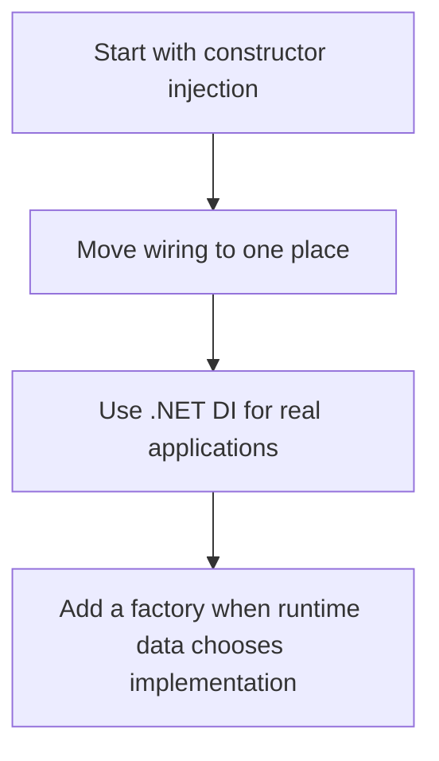

So the short version is:

> DI is for fixed dependencies; factories are for runtime variation.

```text
Use DI when dependencies are fixed at startup.
Use a Factory when dependencies vary at runtime.
Use them together when startup wiring and runtime choice both matter.
```
