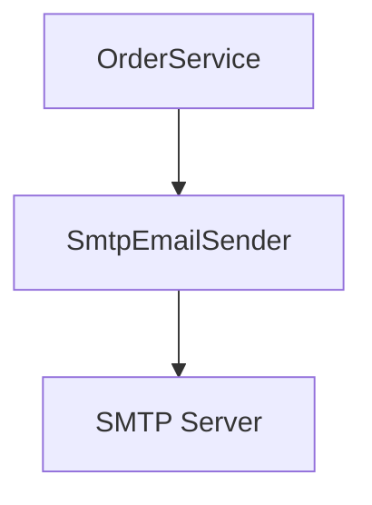
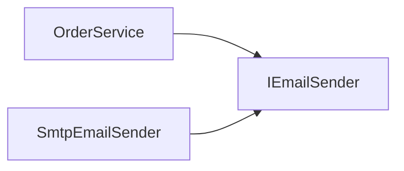
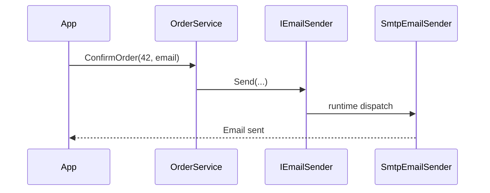
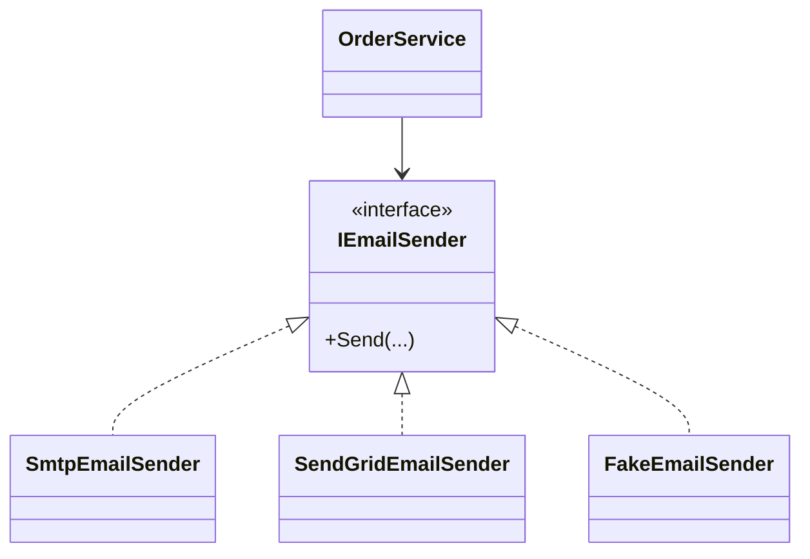
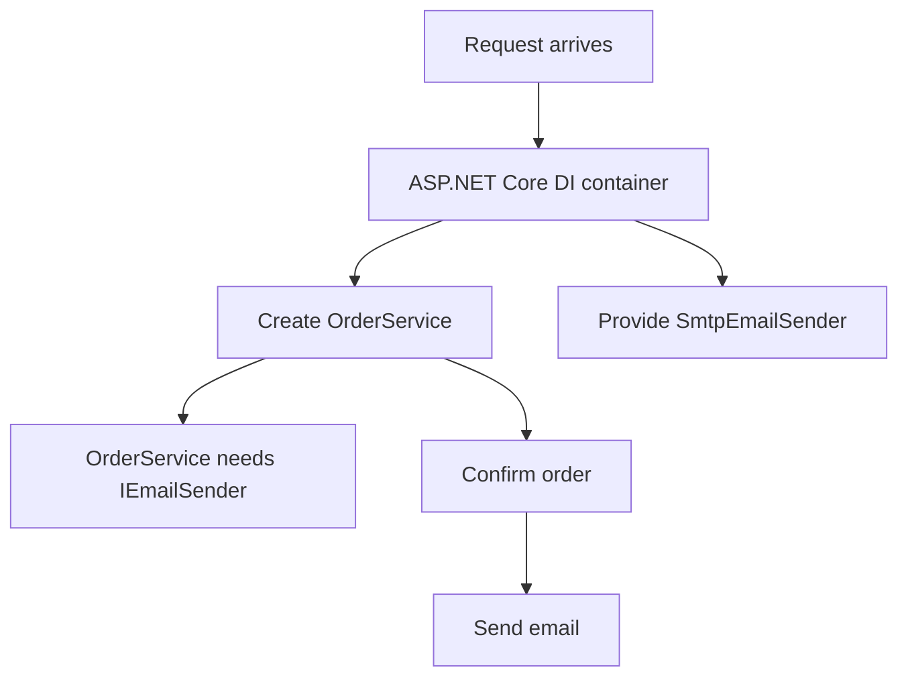
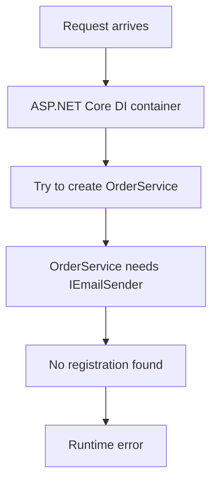
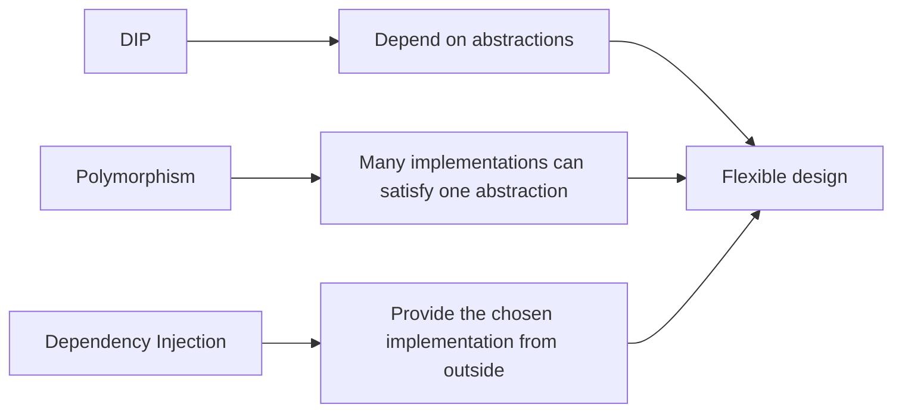
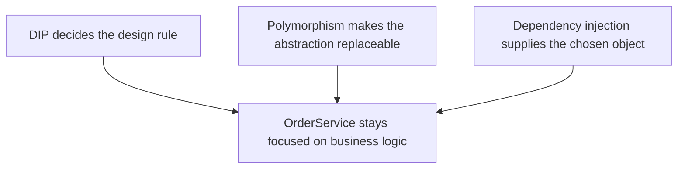

# Dependency Inversion Principle

*A simple explanation of DIP, polymorphism, and dependency injection in C#*

---

## The Big Idea

The **Dependency Inversion Principle** is one of the SOLID principles.

In simple English:

> High-level code should not depend directly on low-level code. Both should depend on an abstraction.

That sounds abstract, so let us translate it.

A high-level class contains business behavior.  
A low-level class contains technical details.

For example:

- `OrderService` is high-level because it decides what should happen when an order is confirmed.
- `SmtpEmailSender` is low-level because it knows the technical detail of sending email through SMTP.

Without DIP, the high-level class directly creates or depends on the low-level class.



This means `OrderService` is tied to `SmtpEmailSender`.

If we want to send email using SendGrid, write to a queue, or fake email sending in a test, we have to change `OrderService`.

That is the problem DIP tries to avoid.

---

## Code Without DIP

Here is a simple example.

```csharp
public sealed class SmtpEmailSender
{
    public void Send(string to, string subject, string body)
    {
        Console.WriteLine($"Sending SMTP email to {to}");
    }
}

public sealed class OrderService
{
    public void ConfirmOrder(int orderId, string customerEmail)
    {
        Console.WriteLine($"Order {orderId} confirmed.");

        var emailSender = new SmtpEmailSender();
        emailSender.Send(
            customerEmail,
            "Order confirmed",
            $"Your order {orderId} is confirmed.");
    }
}
```

This works, but it creates tight coupling.

`OrderService` knows too much:

- it knows that email is sent using SMTP
- it knows which concrete class to create
- it cannot easily use another email sender
- it is harder to test without sending a real email

The dependency direction looks like this:


The high-level business rule depends on the low-level technical detail.

---

## What Does "Inversion" Really Mean?

The dependency is inverted when both classes depend on an abstraction.

Instead of this:


We make this:



Now `OrderService` does not depend on `SmtpEmailSender`.

`OrderService` depends on `IEmailSender`.

`SmtpEmailSender` also depends on `IEmailSender`, because it promises to implement that contract.

The direction changed from:

```text
Business code -> technical detail
```

to:

```text
Business code -> abstraction <- technical detail
```

That is the inversion.

The business code owns the expectation.  
The technical detail plugs into that expectation.

---

## Code With DIP

First, create an abstraction.

```csharp
public interface IEmailSender
{
    void Send(string to, string subject, string body);
}
```

Then make the low-level class implement it.

```csharp
public sealed class SmtpEmailSender : IEmailSender
{
    public void Send(string to, string subject, string body)
    {
        Console.WriteLine($"Sending SMTP email to {to}");
    }
}
```

Now the high-level class depends on the abstraction.

```csharp
public sealed class OrderService
{
    private readonly IEmailSender _emailSender;

    public OrderService(IEmailSender emailSender)
    {
        _emailSender = emailSender;
    }

    public void ConfirmOrder(int orderId, string customerEmail)
    {
        Console.WriteLine($"Order {orderId} confirmed.");

        _emailSender.Send(
            customerEmail,
            "Order confirmed",
            $"Your order {orderId} is confirmed.");
    }
}
```

Now `OrderService` does not care how email is sent.

It only cares that something can send email.

---

## The Working Flow

At runtime, a real object still has to do the work.

The abstraction does not send email by itself.  
It only describes what the high-level code needs.



The important detail is that `OrderService` talks to `IEmailSender`.

The actual object behind that interface can be `SmtpEmailSender`, `SendGridEmailSender`, or `FakeEmailSender`.

---

## Where Polymorphism Fits

**Polymorphism** means one abstraction can have many concrete forms.

In this example, all of these classes can be used as an `IEmailSender`.

```csharp
public sealed class SmtpEmailSender : IEmailSender
{
    public void Send(string to, string subject, string body)
    {
        Console.WriteLine($"SMTP email sent to {to}");
    }
}

public sealed class SendGridEmailSender : IEmailSender
{
    public void Send(string to, string subject, string body)
    {
        Console.WriteLine($"SendGrid email sent to {to}");
    }
}

public sealed class FakeEmailSender : IEmailSender
{
    public void Send(string to, string subject, string body)
    {
        Console.WriteLine($"Fake email recorded for {to}");
    }
}
```

All three classes follow the same contract.

So `OrderService` can use any of them without changing its own code.



That is polymorphism helping DIP.

DIP says, "Depend on an abstraction."  
Polymorphism makes it useful by allowing many implementations of that abstraction.

---

## Where Dependency Injection Fits

**Dependency injection** is the way we provide the dependency from the outside.

DIP is the design principle.  
Dependency injection is a technique that helps us follow that principle.

Without dependency injection, `OrderService` creates its own dependency.

```csharp
var emailSender = new SmtpEmailSender();
```

With dependency injection, the dependency is provided to `OrderService`.

```csharp
var emailSender = new SmtpEmailSender();
var orderService = new OrderService(emailSender);

orderService.ConfirmOrder(42, "customer@example.com");
```

This is manual dependency injection.

No framework is required.

The key idea is:

> `OrderService` receives what it needs instead of creating it.

---

## Dependency Injection With ASP.NET Core

In ASP.NET Core, the built-in DI container usually creates objects for us.

```csharp
var builder = WebApplication.CreateBuilder(args);

builder.Services.AddScoped<IEmailSender, SmtpEmailSender>();
builder.Services.AddScoped<OrderService>();

var app = builder.Build();

app.MapPost("/orders/{orderId}/confirm", (
    int orderId,
    OrderService orderService) =>
{
    orderService.ConfirmOrder(orderId, "customer@example.com");
    return Results.Ok();
});

app.Run();
```

The important registration is this:

```csharp
builder.Services.AddScoped<IEmailSender, SmtpEmailSender>();
```

It tells the container:

> When something asks for `IEmailSender`, provide `SmtpEmailSender`.

The flow looks like this:



`OrderService` still depends only on `IEmailSender`.

The container decides which concrete implementation to provide.

---

## What If Dependency Injection Is Not Provided?

DIP does not magically create objects.

If a class asks for an abstraction, somebody must provide a concrete implementation.

This code follows DIP in `OrderService`, but the application forgets to register `IEmailSender`.

```csharp
var builder = WebApplication.CreateBuilder(args);

builder.Services.AddScoped<OrderService>();

var app = builder.Build();

app.MapPost("/orders/{orderId}/confirm", (
    int orderId,
    OrderService orderService) =>
{
    orderService.ConfirmOrder(orderId, "customer@example.com");
    return Results.Ok();
});

app.Run();
```

When ASP.NET Core tries to create `OrderService`, it sees this constructor:

```csharp
public OrderService(IEmailSender emailSender)
{
    _emailSender = emailSender;
}
```

But the container does not know what concrete class should be used for `IEmailSender`.

The result is a runtime error similar to this:

```text
InvalidOperationException: Unable to resolve service for type
'IEmailSender' while attempting to activate 'OrderService'.
```

The diagram is:



This is not a failure of DIP.

It means the design is asking for an abstraction, but the application has not supplied an implementation.

---

## Manual Example Without Providing the Dependency

The same problem can happen without ASP.NET Core.

```csharp
OrderService orderService = new(null!);

orderService.ConfirmOrder(42, "customer@example.com");
```

This compiles because `null!` tells the compiler, "Trust me."

But at runtime, `_emailSender` is null.

When this line runs:

```csharp
_emailSender.Send(
    customerEmail,
    "Order confirmed",
    $"Your order {orderId} is confirmed.");
```

the application throws:

```text
NullReferenceException: Object reference not set to an instance of an object.
```

So dependency injection can be manual or container-based, but the rule is the same:

> If a class needs a dependency, something must provide it.

---

## DIP, Polymorphism, and Dependency Injection Together

These three ideas are related, but they are not the same thing.



Here is the relationship in simple terms.

**DIP**

Depend on an abstraction, not a concrete detail.

In the example, `OrderService` depends on `IEmailSender`.

**Polymorphism**

Different classes can be used through the same abstraction.

In the example, `SmtpEmailSender`, `SendGridEmailSender`, and `FakeEmailSender` all implement `IEmailSender`.

**Dependency injection**

Provide dependencies from the outside.

In the example, the app gives `OrderService` an `IEmailSender` implementation.

You can think of them like this:



DIP is the principle.  
Polymorphism is the language feature.  
Dependency injection is the wiring technique.

---

## Why This Matters

DIP helps keep code easier to change.

When high-level code depends on abstractions:

- testing becomes easier
- technical details can change with less impact
- business logic stays cleaner
- classes become easier to understand
- the application becomes easier to extend

For example, this test can use a fake dependency.

```csharp
public sealed class FakeEmailSender : IEmailSender
{
    public List<string> SentEmails { get; } = new();

    public void Send(string to, string subject, string body)
    {
        SentEmails.Add(to);
    }
}

var fakeEmailSender = new FakeEmailSender();
var orderService = new OrderService(fakeEmailSender);

orderService.ConfirmOrder(42, "customer@example.com");

Console.WriteLine(fakeEmailSender.SentEmails.Count);
```

Output:

```text
1
```

No SMTP server is needed.  
No real email is sent.  
The business behavior can be tested directly.

---

## Final Thought

The Dependency Inversion Principle is about protecting important business code from unstable technical details.

The dependency is inverted when the business code stops pointing directly at the concrete detail and both sides point toward an abstraction.

In short:

```text
Bad:    OrderService -> SmtpEmailSender
Better: OrderService -> IEmailSender <- SmtpEmailSender
```

Once that shape is in place, polymorphism lets us swap implementations, and dependency injection gives the application a clean way to provide the right one.
