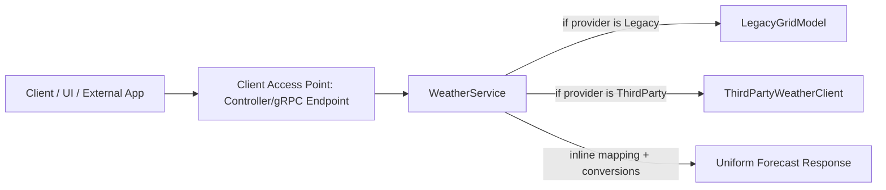
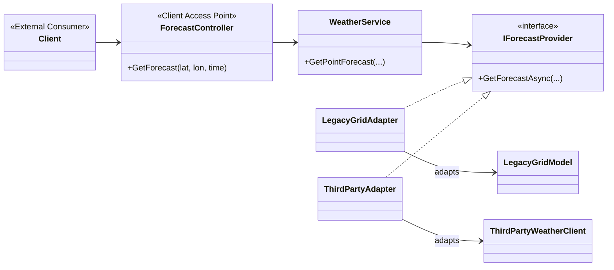
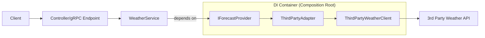
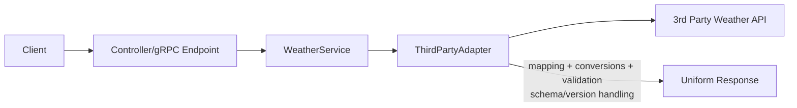
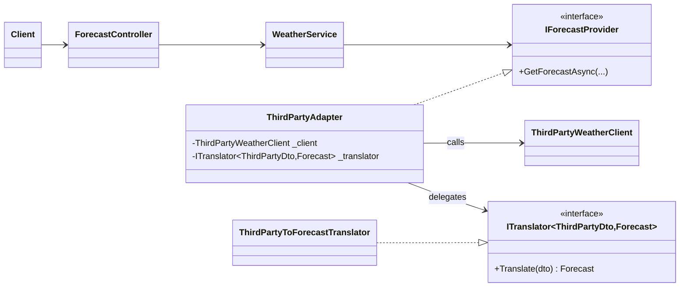
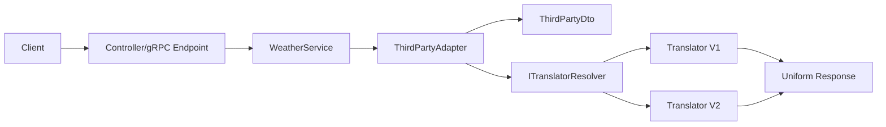

# Adapter Pattern

**Pattern:** Adapter Pattern  
**Category:** Structural

> **The Core Definition:**  
> Imagine you’re traveling from Europe to the US.
You have a European plug, but the wall socket in the US expects an American plug. 

> Your device works perfectly fine — but the interface doesn’t match. Here, you will need the adapter that 
that has European socket and an American plug so that the device gets power. In this case the Adapter adapts to the 
American socket so that your European plug can fit and get power.

> The Adapter Pattern converts the interface of an existing class into an interface the client expects. 
It allows incompatible types to work together by wrapping (“adapting”) a legacy/third‑party component behind a stable internal contract.
In this way, data from multiple external sources can be normalized into a uniform shape for your application, and you can isolate client code from changes in external APIs.

---

## Extrapolating real life analogy to software
1. **Client**: Your device (e.g., laptop, phone) that needs power.
1. Wall socket: The external API or legacy system with an incompatible interface.
1. Plug: The data or functionality you want to use from the external system.
1. Adapter: The software component that wraps the external API and exposes a uniform interface to the client.

Instead of changing your device or rebuilding the wall socket,
you use an adapter that sits in between. It translates compatibility without changing either side.

---

## The Meteorological Example

Let us imagine that we are migrating a large forecasting monolith into a **modular monolith** with multiple forecast domains:
- **Waves**
- **Currents**
- **Atmospheric**

Each module:
- Talks to different data sources (legacy DB, third‑party APIs, internal services). All data sources provide same kind of data.
- Each data source produces different DTO shapes, units, naming, and time semantics

But your platform needs:
- **One uniform response contract** exposed to clients (REST/gRPC/UI)
- Consistent parameter names and units
- Stable client behavior as modules evolve independently

Adapter is the first “boundary tool” that helps you standardize access and contain legacy/foreign interfaces.

---

## Step-by-Step Evolution

### Step 1 — The Anti-Pattern: Branching “God Service”

Before getting into the technicalities of the adapter pattern, let us understand what happens if we don't use it.
We will end up in an anti-pattern and perhaps the code will not be clean enough. Let us see how can we end up in the situation with the help of following example.
Client code (or application service) directly knows about every provider and does mapping inline.



If this design the code for Monolithic Forecast Service will look like this:

```csharp
public class MonolithicForecastService
{
    public async Task<Forecast> GetForecastAsync(object provider, Point p, DateTime at)
    {
        if (provider is LegacyGridModel legacy)
        {
            //Returns temperature in Kelvin and time as ISO string, mapping/parsing is done inline
            var res = await legacy.QueryGridAsync(p.Longitude, p.Latitude, at.ToString("o"));
            return new Forecast(DateTime.Parse(res.isoTime), res.tempKelvin - 273.15, "LegacyGrid");
        }

        if (provider is ThirdPartyWeatherClient thirdParty)
        {
            // Returns temperature in Fahrenheit and time as epoch seconds, mapping/parsing is done inline
            var dto = await thirdParty.GetAsync($"{p.Longitude},{p.Latitude}", new DateTimeOffset(at).ToUnixTimeSeconds());
            return new Forecast(DateTimeOffset.FromUnixTimeSeconds(dto.ts).UtcDateTime, (dto.tempF - 32) * 5 / 9, "ThirdParty");
        }

        // More ifs for other providers...
        throw new NotSupportedException("Provider not supported");
    }
```

**Pain points**
- Adding a provider requires modifying the service (violates **OCP**)
- Mapping logic is duplicated and scattered
- Hard to test (you must set up multiple concrete providers)
- High maintenance tax and fragile changes

---

### Step 2 — Introduce a Stable Contract: `IForecastProvider`

Adapters wrap each incompatible provider and expose a uniform interface.




#### Domain Contract (Uniform Interface)

```csharp
public record Point(double Longitude, double Latitude);
public record Forecast(DateTime Time, double TemperatureCelsius, string Source);

public interface IForecastProvider
{
    Task<Forecast> GetForecastAsync(Point location, DateTime at, CancellationToken ct = default);
}
```
#### Legacy Provider (Incompatible Interface)

```csharp
public class LegacyGridModel
{
    public Task<LegacyGridResult> QueryGridAsync(double lat, double lon, string timeIso)
        => throw new NotImplementedException();
}

public record LegacyGridResult(string isoTime, double tempKelvin);
```

#### Introduce Adapter: Legacy → IForecastProvider
```csharp
public sealed class LegacyGridAdapter : IForecastProvider
{
    private readonly LegacyGridModel _legacy;
    private readonly ILogger<LegacyGridAdapter> _log;

    public LegacyGridAdapter(LegacyGridModel legacy, ILogger<LegacyGridAdapter> log)
    {
        _legacy = legacy ?? throw new ArgumentNullException(nameof(legacy));
        _log = log;
    }

    public async Task<Forecast> GetForecastAsync(Point location, DateTime at, CancellationToken ct = default)
    {
        _log.LogDebug("Adapting LegacyGridModel for {lat},{lon} @ {time}",
            location.Latitude, location.Longitude, at);

        var result = await _legacy.QueryGridAsync(location.Latitude, location.Longitude, at.ToString("o"));

        var tempC = result.tempKelvin - 273.15;
        return new Forecast(DateTime.Parse(result.isoTime), tempC, "LegacyGridModel");
    }
}
```

### Legacy Provider (Incompatible Interface) for Third-Party API
```csharp
public class LegacyGridModel
{
    public Task<LegacyGridResult> QueryGridAsync(double lat, double lon, string timeIso)
        => throw new LegacyGridResult("", "");
}

public record LegacyGridResult(string isoTime, double tempKelvin);
```

#### Introduce Adapter: Third-Party → IForecastProvider

```csharp
public sealed class ThirdPartyAdapter : IForecastProvider
{
    private readonly ThirdPartyWeatherClient _client;
    private readonly ITranslator<ThirdPartyDto, Forecast> _translator;

    public ThirdPartyAdapter(ThirdPartyWeatherClient client, ITranslator<ThirdPartyDto, Forecast> translator)
    {
        _client = client;
        _translator = translator;
    }

    public async Task<Forecast> GetForecastAsync(Point location, DateTime at, CancellationToken ct = default)
    {
        var dto = await _client.GetAsync(
            $"{location.Latitude},{location.Longitude}",
            new DateTimeOffset(at).ToUnixTimeSeconds(),
            ct);

        return _translator.Translate(dto);
    }
}
```

#### Third-Party Provider (Incompatible Interface)
```csharp
public class ThirdPartyWeatherClient
{
    public Task<ThirdPartyDto> GetAsync(string latLon, long epochSeconds, CancellationToken ct = default)
        => return new ThirdPartyDto("", "");
}

public record ThirdPartyDto(long ts, double tempF);
```

**What changed?**
- Each provider is now behind an adapter that implements `IForecastProvider`.
- Client access point and app services depend on a stable abstraction.
- New providers are added by adding new adapters rather than editing core logic of the service.
- Cleaner unit tests (mock `IForecastProvider`).

**Note that both adapters return `Forecast`, which is a return unifrom type and the contract that client does not need to worry about.
Thus the problem of not having unified contracts is efficiently solved here.**


---

### Step 3 — Add DI Boundary: Wiring Matters

Adapters and their dependencies are composed in the DI container (composition root).



**Key insight**
- The adapter should **not** decide which concrete dependencies to create.
- DI wiring is where you decide which implementation is active.
- This way, we tell the adapter “use this client and translator” without hardcoding it, and we can swap implementations by changing DI configuration rather than code.

Now the question still remains - how and where do we decide which adapter to use?

---

### Step 4

The WeatherService depends only on the abstraction (`IForecastProvider`), not on concrete adapters or providers. This allows us to keep the service clean and focused on application logic, while the adapters handle integration details.
Then who decides the concrete implementation of `IForecastProvider`? The DI container does, based on how we register our services. For example, if we register `ThirdPartyAdapter` as the implementation for `IForecastProvider`, then the WeatherService will use that adapter without needing to know about it.
But it is the client access point (controller) that calls the WeatherService, and it does not need to know about the adapters or providers either. It just calls the service method and gets a uniform `Forecast` response.

```csharp
public sealed class WeatherService
{
    private readonly IForecastProvider _provider;

    public WeatherService(IForecastProvider provider)
    {
        _provider = provider;
    }

    public Task<Forecast> GetPointForecast(Point p, DateTime at, CancellationToken ct = default)
        => _provider.GetForecastAsync(p, at, ct);
}
```

Since the WeatherService does not know about the concrete implementation of `IForecastProvider`, it is decoupled from the specific adapters and providers. This allows us to change the underlying implementation without affecting the service or its clients, adhering to the Open/Closed Principle (OCP) and Dependency Inversion Principle (DIP).
But it is expected that the client knows about the WeatherServiceProvider, and it is the controller that calls the WeatherService. The controller does not need to know about the adapters or providers either. It just calls the service method and gets a uniform `Forecast` response.
So, somewhere in the client code, it should have a line like this:

```csharp
var lagacyData = new WeatherService(LegacyGridAdapter);
var thirdPartyData = new WeatherService(ThirdPartyAdapter);
```

The client in this case does not necessarily mean an external consumer or a customer. All it means is any service which is consuming our adapter pattern.
Also, another point to note is that adapter pattern does not entirely get rid of the need for branching logic. It just moves it to the composition root (DI wiring) rather than having it in the core service logic. This is a good thing because it keeps the core service clean and focused on application logic, while the branching logic is isolated in the composition root where it belongs.

---
Perhaps put this in part2.
### Step 4 — The Next Scaling Problem: Parsing Bloats the Adapter

When mapping grows (units, time alignment, quality flags, parameter renames), adapters become “dump zones.”



**Smell**
- Adapter now handles both integration orchestration **and** transformation policy.
- Multiple reasons to change the same class.

---

### Step 5 — Introduce a Translator (Parser/Mapper) Collaborator

Adapter orchestrates IO; translator handles data-shape conversion and normalization.



**Result**
- Adapter stays small and integration-focused
- Translator becomes pure, testable, reusable, versionable

---

### Step 6 — Optional: Runtime Translator Selection via Resolver

Only when needed (v1/v2 payloads, content-type variation, schema flags).



**Note**
- Prefer a resolver over putting Factory Method complexity inside the adapter.

---

## ✅ The "Refactored": Life With Adapter (Server-side / Core)

### Legacy Provider (Incompatible Interface)


### Adapter: Legacy → IForecastProvider


### Translator: ThirdPartyDto → Forecast

```csharp
public interface ITranslator<TSource, TTarget>
{
    TTarget Translate(TSource source);
}

public sealed class ThirdPartyToForecastTranslator : ITranslator<ThirdPartyDto, Forecast>
{
    public Forecast Translate(ThirdPartyDto dto)
    {
        var time = DateTimeOffset.FromUnixTimeSeconds(dto.ts).UtcDateTime;
        var tempC = (dto.tempF - 32) * 5.0 / 9.0;
        return new Forecast(time, tempC, "ThirdParty");
    }
}
```

### Adapter: Third-Party → IForecastProvider (Delegates translation)


---

## ✅ Client-side Example: Life With Adapter

### Client Access Point (Controller) stays simple

```csharp
[ApiController]
[Route("api/forecast")]
public sealed class ForecastController : ControllerBase
{
    private readonly WeatherService _service;
    public ForecastController(WeatherService service) => _service = service;

    [HttpGet("point")]
    public async Task<ActionResult<Forecast>> GetPoint(
        [FromQuery] double lat,
        [FromQuery] double lon,
        [FromQuery] DateTime at,
        CancellationToken ct)
    {
        var forecast = await _service.GetPointForecast(new Point(lat, lon), at, ct);
        return Ok(forecast);
    }
}
```

### Application Service depends only on abstraction

```csharp
public sealed class WeatherService
{
    private readonly IForecastProvider _provider;
    public WeatherService(IForecastProvider provider) => _provider = provider;

    public Task<Forecast> GetPointForecast(Point p, DateTime at, CancellationToken ct = default)
        => _provider.GetForecastAsync(p, at, ct);
}
```

---

## ❌ The "Anti-Pattern": Life Without Adapter (Server-side / Core)

```csharp
public sealed class MonolithicForecastService
{
    public async Task<Forecast> GetForecastAsync(object provider, Point p, DateTime at)
    {
        if (provider is LegacyGridModel legacy)
        {
            var res = await legacy.QueryGridAsync(p.Latitude, p.Longitude, at.ToString("o"));
            return new Forecast(DateTime.Parse(res.isoTime), res.tempKelvin - 273.15, "LegacyGrid");
        }

        if (provider is ThirdPartyWeatherClient third)
        {
            var dto = await third.GetAsync($"{p.Latitude},{p.Longitude}", new DateTimeOffset(at).ToUnixTimeSeconds());
            var tempC = (dto.tempF - 32) * 5.0 / 9.0;
            return new Forecast(DateTimeOffset.FromUnixTimeSeconds(dto.ts).UtcDateTime, tempC, "ThirdParty");
        }

        throw new NotSupportedException("Provider not supported");
    }
}
```

### The Code Smell
- Type checks and branching logic (`if provider is ...`)
- Mapping duplicated across branches
- Central service becomes the bottleneck for changes

### The Tech Lead’s Critique
- **Maintenance tax:** each new provider adds branching and mapping
- **Testing difficulty:** must instantiate concrete types or mock messy seams
- **Fragility:** changes in external DTOs ripple into core service
- **OCP violation:** the central service must be modified for every addition

---

## ❌ Client-side Example: Life Without Adapter

```csharp
[ApiController]
[Route("api/forecast")]
public sealed class ForecastController : ControllerBase
{
    private readonly MonolithicForecastService _svc;
    private readonly object _provider; // leaky abstraction

    public ForecastController(MonolithicForecastService svc, object provider)
    {
        _svc = svc;
        _provider = provider;
    }

    [HttpGet("point")]
    public async Task<ActionResult<Forecast>> GetPoint(double lat, double lon, DateTime at)
    {
        // Controller is now indirectly coupled to all providers
        var forecast = await _svc.GetForecastAsync(_provider, new Point(lat, lon), at);
        return Ok(forecast);
    }
}
```

**What’s wrong**
- Controllers/services are forced to carry “provider identity” around
- Adding providers increases client-side complexity and risk

---

## Real-life Use Cases

### Where Adapter shines in production .NET systems
- **Modular monolith migration:** unify waves/currents/atmospheric behind a stable contract
- **Legacy SDK integration:** wrap vendor classes without changing them
- **Multi-provider strategy:** swap provider implementations without changing client code
- **Version migrations:** keep `IForecastProvider` stable while external providers change
- **Standardizing responses:** internal canonical DTOs (GeoJSON/Open-Meteo-like) maintained centrally

### Your example (from this discussion)
> Adapter pattern is used while converting a monolith into modular monoliths.  
> Waves/Currents/Atmospheric domains needed to be represented uniformly.

That is exactly the “textbook real world” use of Adapter.

---

## Correct Dependency Injection Strategy

### The lifetime rule (Tech Lead rule)
> The adapter lifetime must not be longer than the shortest lifetime of its dependencies.

### Why “Singleton by default” is risky
Singleton is only safe when the service is:
- stateless
- thread-safe
- not dependent on scoped services (DbContext)

### Recommended DI wiring for the example

```csharp
// HTTP client should typically be factory-managed
builder.Services.AddHttpClient<ThirdPartyWeatherClient>();

// Translators are pure => singleton is ideal
builder.Services.AddSingleton<ITranslator<ThirdPartyDto, Forecast>, ThirdPartyToForecastTranslator>();

// Adapters are orchestration & usually stateless => transient is safe default
builder.Services.AddTransient<IForecastProvider, ThirdPartyAdapter>();

// App service (often scoped in web apps, but can be transient too)
builder.Services.AddScoped<WeatherService>();
```

### When adapter must be Scoped
If adapter depends on:
- DbContext
- other scoped per-request services

Then adapter must be scoped:

```csharp
builder.Services.AddScoped<IForecastProvider, DbBackedForecastAdapter>();
```

---

## Parsing Placement: Adapter vs Translator (What we concluded)

### Recommended placement
- **Adapter:** orchestration (call third party, handle errors, cancellation, logging context)
- **Translator/Parser:** mapping & normalization policy (DTO shape conversions, units, naming, missing-value handling)
- **Optional Validator:** deeper domain validation

### Why parsing *inside* adapter tends to drift away from Clean Architecture and SOLID
Not because it’s forbidden, but because it commonly grows into:
- conversions
- normalization rules
- schema/version handling
- missing-data policy

That creates multiple reasons to change the adapter (**SRP pressure**) and couples policy to vendor DTO shapes (**DIP pressure**).

### When parsing inside adapter is acceptable
If mapping is genuinely tiny and stable (2–5 simple fields), it’s fine.  
Once it grows or needs dedicated tests, extract it to a translator.

---

## “Is there a translator/parser pattern?”

Patterns and concepts that cover this role:
- **Anti-Corruption Layer (DDD):** shield your domain from foreign models
- **Data Mapper (Fowler):** map between models (DTO → canonical)
- **Strategy:** choose among translation algorithms (v1/v2, schemas)
- **Chain of Responsibility:** parsing/normalization pipeline
- **Interpreter:** real parsing of grammars (rare for DTO mapping)

In most enterprise .NET systems: **Adapter + Data Mapper/ACL** is the common combination.

---

## “How does adapter know which translator to create?” (Best solution)

### Best default solution (no runtime selection)
✅ **Constructor-inject a single translator**, let DI choose the implementation.

**Why**
- Adapter stays SRP-clean
- No factories inside adapter
- Easy to test

### If runtime selection is required
✅ Inject a **resolver**, not Factory Method complexity inside adapter.

Example idea:
- `ITranslatorResolver` chooses translator based on schema version flags, content type, etc.

---

## Decision Checklist: Is Adapter suitable?

- Do you have incompatible interfaces (legacy SDKs, third parties, mismatched signatures)?
- Do you need a stable internal contract while providers evolve independently?
- Do you want to isolate integration details from app/domain logic?
- Will you add more providers/domains over time?
- Do you need to unit test your application logic without spinning up real providers?

If most answers are “yes”, Adapter is a strong fit.

---

## Patterns Used Together

- **Factory / Abstract Factory:** build/select the correct adapter per domain/provider
- **Strategy:** adapters often *are* strategies behind `IForecastProvider`
- **Decorator:** add caching/retries/metrics around `IForecastProvider` without changing adapters
- **Facade:** expose a simplified aggregated forecast API across multiple adapters
- **Anti-Corruption Layer / Data Mapper:** translation layer to protect your canonical model

---

## SOLID Impact

- **SRP:** Adapter orchestrates; Translator transforms. Each has one reason to change.
- **OCP:** Add new adapters/translators without modifying existing client code.
- **ISP:** Clients depend on a small `IForecastProvider`, not large vendor APIs.
- **DIP:** High-level modules depend on abstractions (`IForecastProvider`, `ITranslator`), not concrete providers.
- **LSP (note):** Works when adapters honor interface semantics consistently.

---

## Key Takeaway for Tech Leads

Adapter is a high-leverage pattern for integration-heavy systems:
- It **decouples** clients from incompatible provider interfaces
- It improves **testability** and reduces **maintenance tax**
- With a Translator/Mapper, it scales cleanly as normalization rules grow
- DI wiring becomes your composition control point
- It’s especially powerful in **modular monolith migrations** (waves/currents/atmospheric → uniform contract)

---

## Appendix: Complete End-to-End Diagram (Client + Access Point + DI + Translator)

```mermaid
flowchart LR
Client[Client / UI / External App] --> AP[Client Access Point\nController/gRPC Endpoint]
AP --> App[Application Service\nWeatherService]
App -->|depends on| IFP[IForecastProvider]

subgraph DI["DI Container"]
  IFP --> A[ThirdPartyAdapter]
  A --> C[ThirdPartyWeatherClient\n(AddHttpClient)]
  A --> T[ThirdPartyToForecastTranslator\n(Singleton)]
end

C --> External[Third Party API]
T --> Canon[Uniform Response]
```

