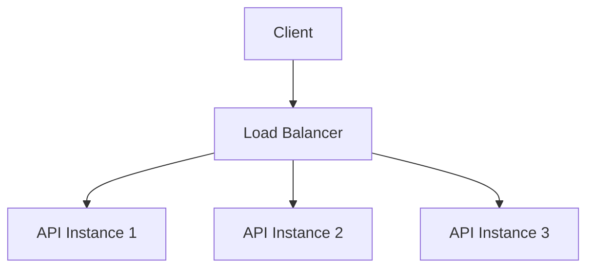
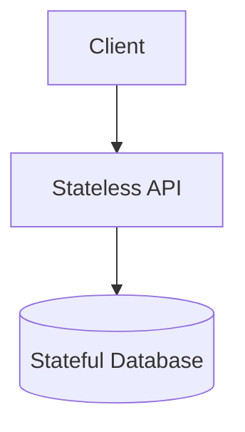
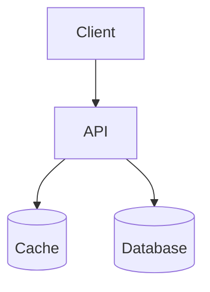
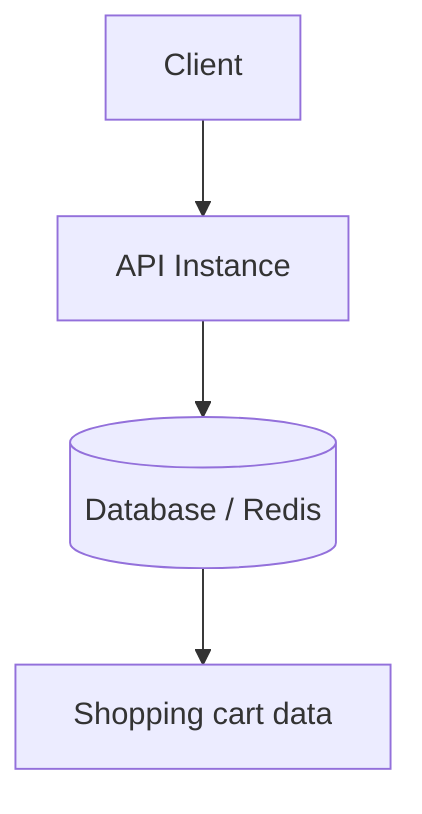
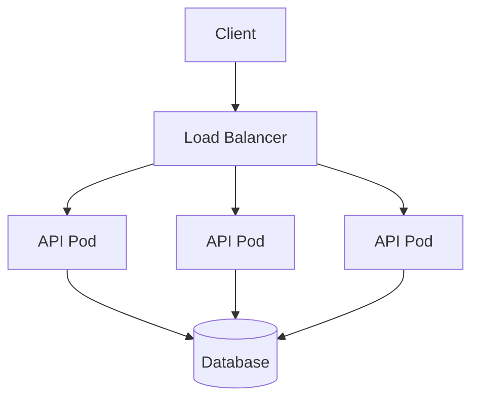
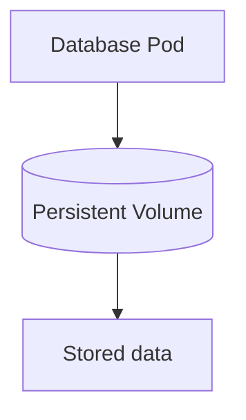
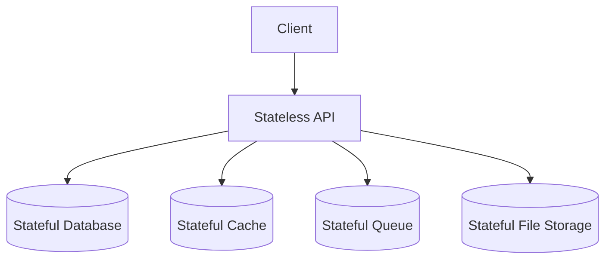

# Stateful vs Stateless Applications

When we talk about modern software architecture, APIs, databases, caches, Kubernetes, microservices, or cloud-native applications, two words come up again and again:

**Stateful** and **stateless**.

These words sound technical, but the idea behind them is actually quite simple.

In simple English:

> **State means memory.**

If an application needs to remember something from the previous request or previous action, it is dealing with state.

If it does not need to remember anything locally and every request contains everything needed to process it, then it is stateless.

That is the core idea.

But, as usual in software, the moment we say “simple”, someone will add Redis, Kubernetes, sticky sessions, load balancers, queues, and five production incidents into the discussion.

So let us break it down properly.

---

## A Real-Life Example

Imagine you go to a coffee shop.

You go to the counter and say:

> “One cappuccino, medium size, takeaway.”

The cashier prepares your order. Tomorrow, if you go again, the cashier may ask you the same questions again.

They do not need to remember yesterday’s order. Every order contains all the information needed.

This is like a **stateless** system.

Each request is independent.

Now imagine you are in a restaurant.

You sit at table 5. The waiter remembers that:

- You ordered soup.
- You asked for no onions.
- You are still waiting for the main course.
- You have not paid yet.

The next interaction depends on what happened earlier.

This is **stateful**.

The waiter is maintaining memory about your visit.

So in very simple words:

> **Stateless is like a cashier who asks for everything every time.**  
> **Stateful is like a waiter who remembers your table, order, and progress.**

---

## Technical Meaning

In software, state can be many things:

- User session
- Login information
- Shopping cart
- Uploaded files
- Workflow progress
- Cached data
- Database records
- Messages waiting in a queue
- Temporary in-memory values
- Local files
- Locks, counters, timers, or job status

So when we ask whether an application is stateful or stateless, we are really asking:

> **Does this application instance need to remember something between requests?**

That phrase “application instance” is very important.

Because almost every real system has state somewhere.

A weather API may be stateless, but it probably reads data from a database. The API itself may not store memory, but the database definitely does.

So we should not ask:

> “Does the system have data?”

Of course it has data. Otherwise, why are we even building it?

The better question is:

> **Where is the state stored?**

---

## Is an API Stateful or Stateless?

Most APIs are designed to be **stateless**.

For example:

```http
GET /weather?lat=59.91&lon=10.75&date=2026-05-31
Authorization: Bearer some-token
```

This request contains the information needed:

- Latitude
- Longitude
- Date
- Authentication token

The API receives the request, processes it, returns a response, and does not need to remember anything locally for the next request.

That API is stateless.

A stateless API is nice because any instance can handle any request.



The load balancer can send the request to any instance.

Instance 1, 2, or 3 should all behave the same way.

That makes scaling easier.

---

## Stateless Does Not Mean “No Database”

This is one of the most common misunderstandings.

Someone may say:

> “Our API uses a database, so it is stateful.”

Not necessarily.

An API can be stateless and still use a database.

Example:



The API does not store important data inside its own memory.

The database stores the actual business data.

So the correct classification is:

```text
API = stateless
Database = stateful
Overall system = stateful
```

This distinction is very important.

We are not saying the whole system has no state. We are saying the API instance itself does not own the state.

---

## Is a Database Stateful?

Yes.

A database is almost always stateful.

That is literally its job.

It stores:

- Users
- Orders
- Payments
- Forecast data
- Configuration
- Customer information
- Historical records
- Business-critical data

If a database loses its data, we have a real problem.

Not a “clear browser cache and try again” problem.

A real production problem.

A database needs:

- Persistent storage
- Backup
- Recovery
- Replication
- Failover
- Data consistency
- Careful migration

So a database is a stateful component.

Simple rule:

> **Database = long-term memory.**

---

## Is Cache Stateful or Stateless?

A cache is also stateful because it stores data.

But cache is slightly different from a database.

A database is usually the **source of truth**.

A cache is usually used for **speed**.

Example:



The API first checks the cache.

If the data is found, it returns quickly.

If the data is not found, it reads from the database and may store the result in cache for next time.

So yes, cache is stateful.

But it can be temporary state.

If Redis is only used as a performance cache, losing it may not be a disaster. The system can rebuild the cache from the database.

But if Redis is used to store sessions, carts, locks, or job status, then Redis becomes more important.

And if Redis is the only place where important business data exists, then Redis is no longer “just cache”. It is now a critical stateful data store.

So the better answer is:

```text
Cache = stateful
But the importance of that state depends on how the cache is used
```

---

## Example: Login Session

Let us say a user logs in.

### Stateful API Design

The API stores the user session in local memory.

```text
API Instance 1 memory:
session123 = Rushikesh
```

Now the next request from the same user must go back to API Instance 1.

If the load balancer sends the request to API Instance 2, that instance may say:

> “I have no idea who this person is.”

That means the API is stateful.

It depends on local memory.

To make this work, teams often use sticky sessions.

Sticky sessions mean the load balancer keeps sending the same user to the same server.

That can work, but it makes scaling and failure handling harder.

### Stateless API Design

Instead, the API can use token-based authentication.

The user logs in and receives a token.

Then every request sends the token.

```http
Authorization: Bearer some-token
```

Now any API instance can validate the token and process the request.


The API instances do not need to store the session locally.

This makes the API stateless from the application instance point of view.

---

## Example: Shopping Cart

Shopping cart is a great example because it looks simple until you scale it.

### Bad Design: Cart in API Memory

```text
API Instance 1 memory:
user123 cart = [milk, bread, eggs]
```

This is stateful.

If API Instance 1 restarts, the cart is gone.

If the next request goes to API Instance 2, the cart is not there.

Now the user is angry because the eggs disappeared.

And honestly, nobody wants production incidents because of missing eggs.

### Better Design: Cart in External Storage



Now the API can remain stateless.

The cart state exists, but it is stored outside the API instance.

Any API instance can read or update the cart.

This is the common pattern:

> Keep application services stateless.  
> Store important state in dedicated stateful systems.

---

## Kubernetes and Cloud-Native Thinking

This topic becomes even more important when we run applications in containers or Kubernetes.

A stateless API is easy to run in Kubernetes.



If one API pod dies, Kubernetes can create a new one.

No important data is lost because the pod did not store important data locally.

That is why stateless applications are easier to:

- Scale
- Restart
- Replace
- Deploy
- Load balance
- Recover after failure

Stateful applications are harder because they need stable storage and careful recovery.

For example, a database pod needs persistent volume.



If the pod restarts, the data must still exist.

That is why databases, queues, and storage systems need much more careful design than stateless APIs.

---

## The Best Question to Ask

When trying to decide whether an application is stateful or stateless, ask this:

> **If I kill this application instance right now, what do we lose?**

If the answer is:

> “Nothing important. Another instance can continue.”

Then the application is probably stateless.

If the answer is:

> “We lose user sessions, files, jobs, progress, carts, or important data.”

Then the application is stateful, or at least partially stateful.

This is one of the simplest and most useful tests.

---

## Team Questionnaire: Stateful or Stateless?

When discussing this with your team, you can ask these yes/no questions.

### Strong Stateful Signals

If the answer is yes to any of these, the application is probably stateful or partially stateful.

| Question | Why it matters |
|---|---|
| If the application restarts, do we lose important data? | Strong sign of state |
| Does the application store user sessions in local memory? | Local session state |
| Does the next request from a user need to go to the same instance? | Instance dependency |
| Do we need sticky sessions in the load balancer? | Usually means local state |
| Does the app store shopping cart or workflow progress in memory? | Business state in app |
| Does the app write important data to local disk? | Local persistent state |
| Does the app keep important background jobs in memory? | Work can be lost |
| Can two instances return different results because of local memory? | Inconsistent local state |

### Stateless Signals

If most of these are yes, the application is likely stateless.

| Question | Why it matters |
|---|---|
| Can any instance handle any request? | No instance dependency |
| Can the app restart without losing important data? | Disposable instance |
| Is important state stored outside the app? | External state storage |
| Can we scale from 1 instance to 10 without special routing? | Easy horizontal scaling |
| Are local memory and local disk disposable? | No critical local state |
| Can a new instance start and behave like existing ones? | Replaceable instance |
| Does each request contain enough information to process it? | Independent requests |
| Can another instance continue if one crashes? | Failure tolerance |

---

## Common Classifications

Here are some practical examples.

| Component | Usually Stateful or Stateless? | Explanation |
|---|---|---|
| REST API with JWT | Stateless | Any instance can process the request |
| API with local sessions | Stateful | User depends on a specific instance |
| Database | Stateful | Stores permanent data |
| Redis cache | Stateful | Stores temporary or important state |
| Message queue | Stateful | Stores messages until processed |
| File storage | Stateful | Stores files |
| Background worker | Usually stateless | If work comes from an external queue |
| Background worker with in-memory jobs | Stateful | Jobs can be lost on restart |
| Load balancer | Usually stateless | Unless it maintains sticky sessions |

---

## A Very Important Distinction

A system can have stateless applications and still be a stateful system.

For example:



This is very common.

Actually, this is often what we want.

The API is easy to scale and replace.

The state is stored in systems designed to manage state properly.

---

## Final Summary

Stateful and stateless are not just fancy architecture words.

They help us understand how applications behave when we scale, restart, deploy, or recover from failure.

In simple English:

> **Stateful means the application remembers something important.**  
> **Stateless means the application does not need to remember anything locally between requests.**

An API is usually better when it is stateless.

A database is stateful.

A cache is stateful, but sometimes temporary.

A queue is stateful.

A file system is stateful.

And most real systems are a combination of both.

The goal is not to remove state completely. That is almost impossible.

The goal is to put state in the right place.

Keep application instances as stateless as possible.

Store important state in databases, caches, queues, or storage systems that are designed for it.

That one design decision can make your applications easier to scale, easier to deploy, and much easier to recover when something breaks.

And in production, something always breaks eventually.
