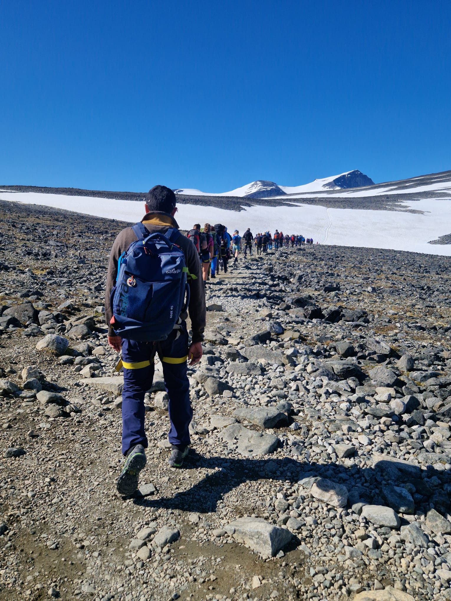
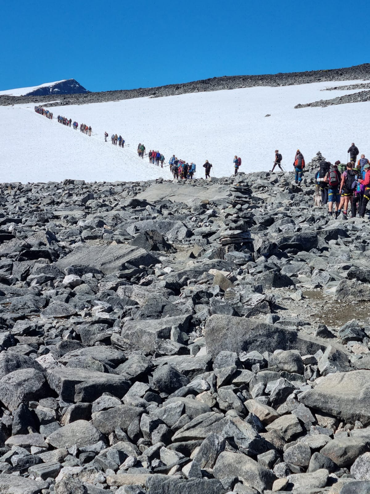
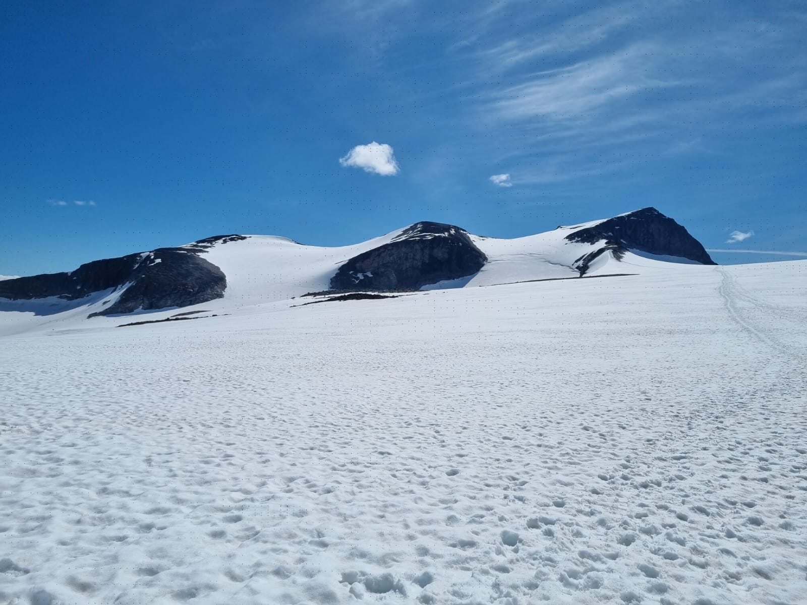
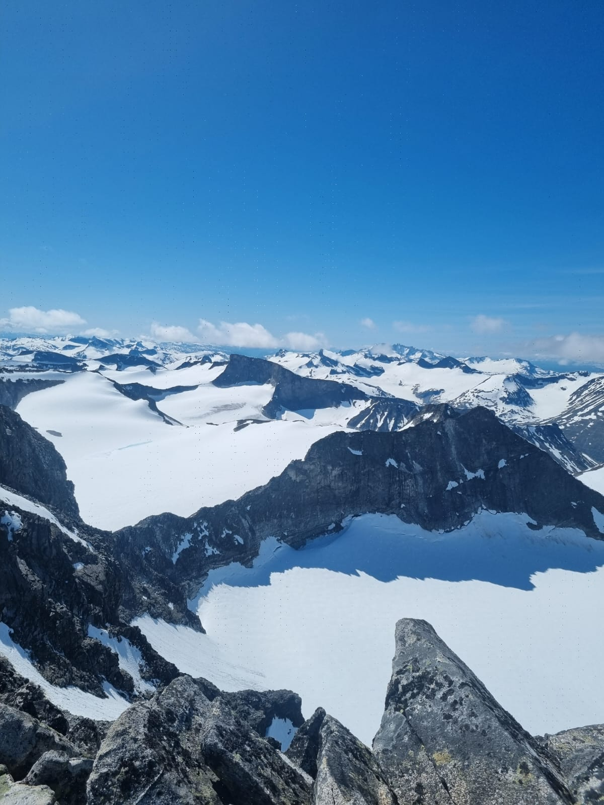
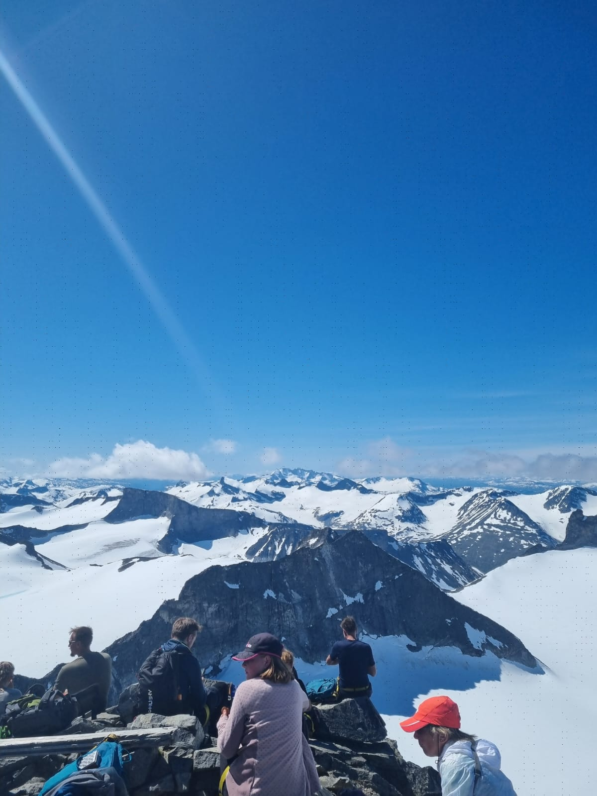

# 2025 Summer hiking trip to Jotunheim

As every year, me and my hiking buddy, Antonio decided to do a hiking trip. This year, we chose another beautiful national park in Norway called Jotunheim national park. This national park lies in the central west Norway and is spread between Bergen and Trondheim. Jotunheim literally means "The home of the giants". This place is home to more than 250 peaks higher than 2000 meters elevation and are a great place for both summer and winter hikes. 2 of the highest peaks in Norway viz. Galdhoppigen and Glittertind lie in this national park.

## How to reach Jotunheim
The major cities near Jotunheim national park are Trondheim and Bergen with a road distance of 280 km and 350 km  respectively. Alternatively it is also possible to take busses and train to Lom. Lom, Vågå and Vang are the major villages in the area.

## Day 1: Bergen to Trondheim
Since we decided to meet up in Trondheim, I took a flight from Bergen to Trondheim on Wednesday morning at 08:30 amd reached at 09:30. We were supposed to meet in Trondheim airport on Thursday instead and drive to the national park right away but me being Rushi, the absurd guy, booked the flight ticket for Wednesday instead. Though I did not regret this in any way, I did have to pay for my stay in Trondheim for a day. 

Once reaching Trondheim, I worked at the airport for a few hours as I did not take a day off and my check-in was at 14:00. Btw, I would certainly recommend a hotel named Pensjonat Jarlen in Trondheim. It is recommended to book directly from their website in order to get the cheapest proice. This hotel is right in the city center and walkable distance from anywhere in the city. 

After reaching the hotel, there was some more work to be done from the hotel room. Recruitement stuff, as a newly promoted manager, I had a hard time hiring the right person. There will be a separate blog for that.

Once that was done, I was off on a walking tour around the city. The only gatholic church in Norway is in Trondheim merely 5 minutes away from the main city square. It was a very sunny day and I was relaxing and walking with some cool Indian podcast in my ears.

## Day 2: Trondheim to Juvashytta
Day 2 started slow as I decided to sleep in late given the intense hikes waiting for us in the next 2 days. I did need some woolen wear to be able to hike, which I purchesed from Internsport which is also right in the city center. At around 11:00, I met Antonio in the city and we started towards Juvashytta. On the way, we decided to stop for a short hike at SNØHETTA. We did find the parking with good electric chargers only to later figure out that we were at the other parking. The website says it is a 20 minutes hike but google maps showed us the hike was 1.5 hours long. Since we got intimidated by this and wanted to preserve energy for the next day, we skipped it and what the exact duration of the hike is, remains a mystery.

The drive was extremely scenic. We encountered many beautiful Viking churches on the way. We took a good stop in Lom village to grab a pizza and get the food reserves stocked for the next day's hike. We reached Juvashytta at around 21:00 in the evening. The road up Juvashytta is a little risky and need full driving attention. Especially towards the top, it gets steep and just 1 lane available to drive at a time. However, the road is very well maintained. 

## Day 3: Summit to the Norway's highest peak
Our guided tour was scheduled to start at 09:30 right outside Juvashytta. As breakfast was already included in the hotel booking, we made sure to eat a good heavy breakfast and load enough calories for the body. There is also a possibility to pack some food with us from Juvashytta canteen. We could carry eggs, bread, make sandwiches and take a food packet with us for a fee of 75 kroners.

As per the scheduled time, everyone did gather at the start point at 09:30. There was a briefing on the hike, the duration, the do's and don'ts and so on. It was a sunny day and having sunglasses on was strongly recommended. As a matter of fact, guided tours have a rule of not allowing the kids go on glacier without the sunglasses. 

It was about the time to start the hike. We we given harnesses and asked to tie it on to us in order to be identifiable as a part of the group. Galdhoppigen hike is in 3 parts. First part is relatively easy but has huge loose boulders which is typical for any high altitude terrain. This leg took 45 minutes. Anyone with average fitness levels can do this hike. There are people of all the ages starting from 4 to 80. Some people also carry their pets. Due to all the age groups, the pace of the group becomes pace of an average person. Guides intstruct that if someone took more than 1 hour for the 1st leg, they would recommend not contnuing the hike further. We we in good time and could afford to take a 10 minute break at the end of leg 1. Some water and a banana was a good option there.

It was time to start leg 2, which is hiking through the glacier. There was a briefing session about how to walk with ropes tied to the harnesses. We were about 30 people tied to the same rope via harness. It was sunny all throughout the hike. People had managed to get into good rhytm walking together tied to a same rope. It was again a walk between 45 minutes to 1 hour. It was a plain walk on glacier not tough in any way. Only thing is that it is difficult to stop walking as 1 person stopping could potentially stop all 30 people tied to the rope. There was again a 15 minutes break at the end of leg 2. People had another quick bite and some water. We were now asked to do the 3rd leg on our own without a guide as it was doable without one. We were at the end of 2nd leg at about 12:15 and were were instructed to be back to the same point at 14:30. 

3rd leg was a bit challenging as it was an uphill and the last part of the uphill was in snow making it further challenging. But we made it at 13:00 to the top. There were about 200 people which slowed us down during the uphill. And once on top, we only had great views to watch and relax.

We were finally on top of Norway at 2469 moh. The guide mentioned that this was one of the top 3 best days of 2025 at Galdhoppigen weather wise. There was absolutely no wind at the top, even lesser than 5 m/s which is quite a blessing in itself. The minimum average windspeed is at least 12 m/s. It felt like hanging out in a garden, with Sun shinning overhead. We took some great pictures at the top and the hike felt worth the effort. We had light lunch at the top.

### Referrences -
1. https://jotunheimen.com/
2. https://www.visitjotunheimen.com/about/jotunheimen-national-park
3. Pensjonat Jarlen hotel - https://www.jarlen.no/
4. Snohetta - https://www.visitnorway.com/listings/viewpoint-sn%C3%98hetta/181161/

